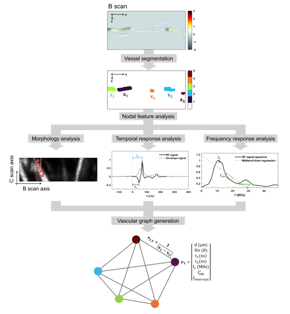
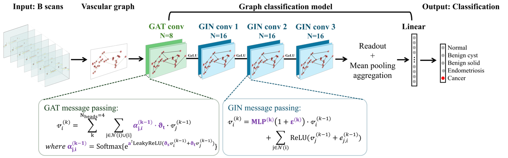
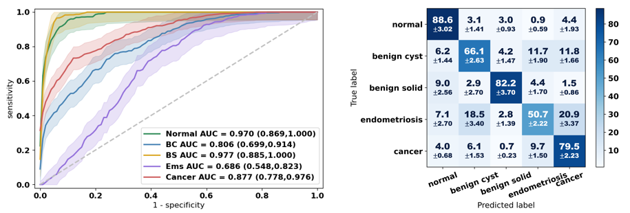
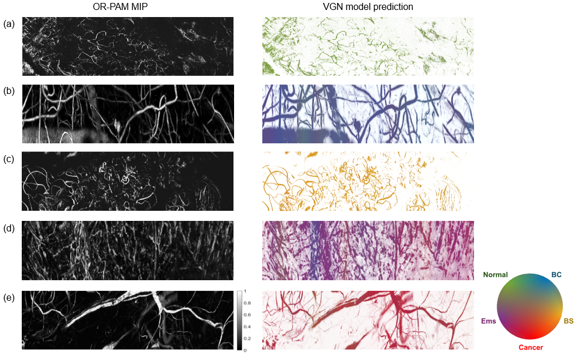

# VGN: Vascular graph network for ovarian OR-PAM

This repository contains the implementation of **VGN** from the manuscript:
**"Vascular graph network for ovarian lesion classification using optical-resolution photoacoustic microscopy"**

## Manuscript abstract:
Diagnosing ovarian lesions is challenging because of their heterogeneous clinical presentations. Some benign ovarian conditions, such as endometriosis, can have features that mimic cancer. We use optical-resolution photoacoustic microscopy (OR-PAM) to study the differences in ovarian vasculature between cancer and various benign conditions. In this study, we converted OR-PAM vascular data into vascular graphs augmented with physical vascular properties. From 94 ovarian specimens, a custom vascular graph network (VGN) was developed to classify each graph as either normal ovary, one of three benign pathologies, or cancer. We demonstrated for the first time that, by leveraging the intrinsic similarity between vascular networks and graph constructs, VGN provides stable predictions from sampling surface areas as small as 3 mm x 0.12 mm. In diagnosing cancer, VGN achieved 79.5% accuracy and an area under the receiver operating characteristic curve (AUC) of 0.877. Overall, VGN achieved a five-class classification accuracy of 73.4%.
**keywords**: photoacoustic microscopy, ovarian cancer, multiparametric imaging, deep learning, graph neural network

## Repository structure
- **`data/`** – Dataset utilities
- **`img_processing`** = Image processing utilities (preprocesing of raw RF data and postprocessing for PA feature extraction)
- **`models/`** – Model architectures (choice from various existing GNN structures and the final structure used in VGN)  
- **`train/`** – Training, evaluation, and testing scripts
- **`matlab_scripts`** - Postprocessing code was originally developed in MATLAB, python version is now available in **`img_processing`**
- **`artifacts/`** - Temp data
- **`docs/images/`** – Figures for model illustration and results

## Model architecture
<p align="center">
  
</p>

<p align="center">
  
</p>

## Model performance

<p align="center">
  
</p>

## Model interpretation

<p align="center">
  
</p>


## Getting started
```bash
git clone https://github.com/YXLin1159/PAM-VGN-ovarian-cancer.git
cd PAM-VGN-ovarian-cancer
conda env create -f environment.yml
conda activate pam-vgn